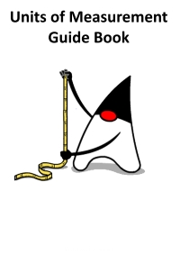

# Units of Measurement Guide Book

This the Guide book for [Units of Measurement](https://github.com/unitsofmeasurement). 

The readable version can be accessed directly on [GitBook](https://lfoppiano.gitbook.io/units-of-measurement/).

 

The Unit of Measurement API provides a set of Java language programming interfaces for handling units and quantities.

The specification contains Interfaces and abstract classes with methods for unit operations:
* Checking of unit compatibility
* Expression of a quantity in various units
* Arithmetic operations on units
